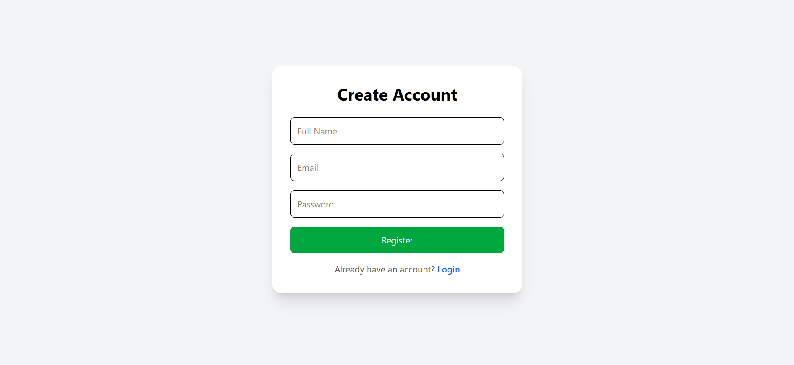
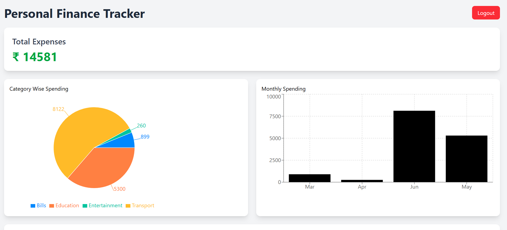
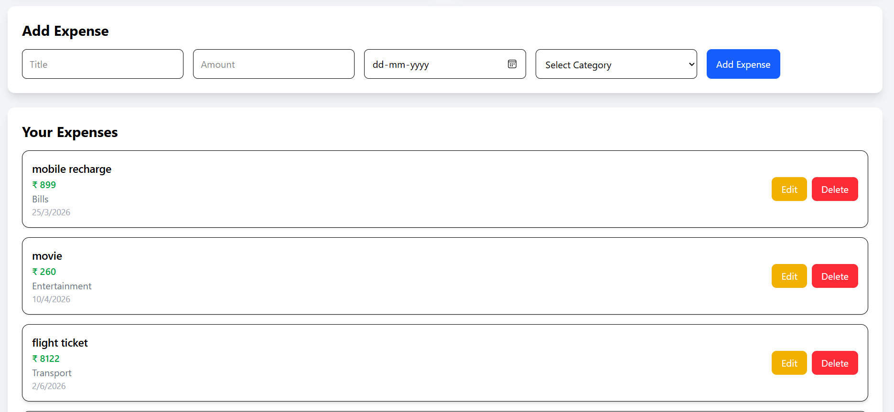

# Personal Finance Tracker

A full-stack MERN application for tracking personal expenses and analyzing spending patterns. Users can securely register, log in, manage expenses, and visualize their spending through interactive charts.

## Live Demo

- Frontend: https://personal-finance-tracker-nu-smoky.vercel.app
- Backend: https://personal-finance-tracker-62ua.onrender.com

---

## Features

- User Registration and Login
- JWT Authentication
- Protected Dashboard
- Add Expenses
- Edit Expenses
- Delete Expenses
- Category-wise Expense Tracking
- Date-wise Expense Recording
- Total Expense Calculation
- Category-wise Spending Analytics
- Monthly Spending Analytics
- Responsive User Interface
- MongoDB Atlas Integration

---

## Tech Stack

### Frontend

- React.js
- Vite
- Tailwind CSS
- Axios
- Recharts
- React Router DOM

### Backend

- Node.js
- Express.js
- MongoDB Atlas
- Mongoose
- JWT Authentication
- bcryptjs

---

## Screenshots

### Registration Page



### Dashboard Analytics



### Expense Management



---

## Project Structure

```text
Personal-Finance-Tracker
│
├── client
│   ├── src
│   ├── public
│   └── package.json
│
├── server
│   ├── models
│   ├── routes
│   ├── middleware
│   └── server.js
│
├── screenshots
│   ├── register.png
│   ├── dashboard.png
│   └── expenses.png
│
└── README.md
```

## Installation and Setup

### Clone the Repository

```bash
git clone https://github.com/Chaitanya-43150/Personal-Finance-Tracker.git
cd Personal-Finance-Tracker
```

### Backend Setup

```bash
cd server
npm install
npm start
```

Create a `.env` file inside the server folder:

```env
MONGO_URI=your_mongodb_connection_string
JWT_SECRET=your_secret_key
```

### Frontend Setup

```bash
cd client
npm install
npm run dev
```

---

## Future Improvements

- Expense Search and Filtering
- Budget Planning and Spending Limits
- Export Expenses to CSV/PDF
- Dark Mode Support
- Advanced Analytics and Reports

---

## Author

**Chaitanya**

B.Tech, Electronics and Electrical Engineering  
Indian Institute of Technology Guwahati